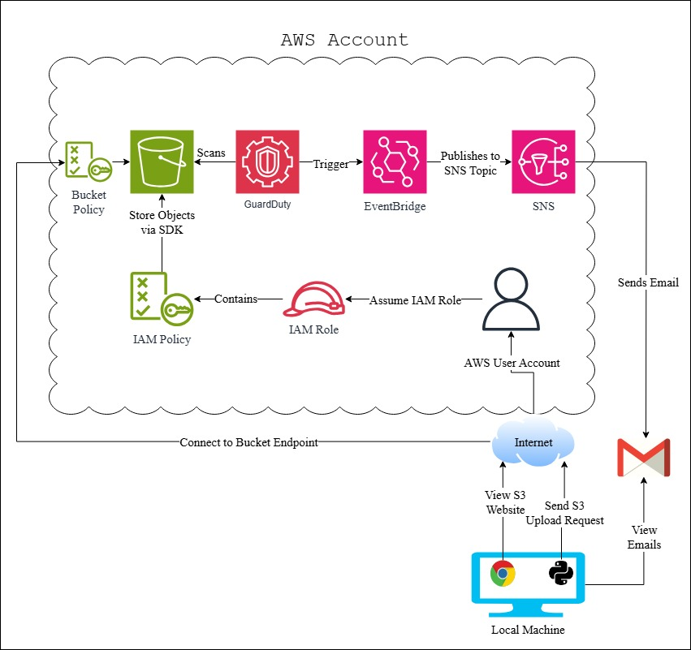

# Project Architecture

This document outlines the architecture to be implemented in the project. The diagram for the proposed architecture is shown below.

*S5 Architecture*

# Requirements
To understand the architecture diagram, we must first establish the requirements. In this project, we aim to:
- Create an S3 bucket that can host a static website
- Ensure the website is publicly accessible
- Restrict bucket content modifications to authorized users
- Prevent the storage of malicious content in the bucket
- Alert the account owner if malicious files are uploaded

# Functionality
In addition to the requirements, we must identify user functionalities:
- The public can access the S3 website through the internet
- AWS user can upload/remove files via the Python SDK
- Files that are being removed were determined malicious after being scanned
- AWS user can receive emails about identified object vulnerabilities

# Architecture Breakdown
**Components**

*S3*
  - A bucket used to host our static website
  - Publicly accessible via the internet
  - File uploads/removes are restricted to IAM roles

*GuardDuty*
  - Scans the S3 bucket for malicious files
  - Triggers an event if malicious files are detected

*EventBridge*
  - Retrieves critical alerts from GuardDuty
  - Triggers an SNS push with the retrieved information

*SNS*
  - Creates an SNS subscription to send alerts via email
  - Defines an SNS topic to include the subscription protocol
  - Sends an email to the user when EventBridge triggers an alert

*IAM*
  - Creates an IAM role that users can assume
  - This role includes a policy granting access to S3 actions
  - S3 Bucket must be IAM configured to allow access to GuardDuty Scans
  - EventBridge must be IAM configured to allow GuardDuty to be able to publish object finding events
  - SNS must be IAM configured to allow EventBridge to publish messages to an SNS Topic

# Benefits
This architecture offers several advantages:
- **High Availability**: The S3 bucket boasts a 99.99% availability rate.
- **High Durability**: There is an extremely low probability of data loss, with a durability rate of 99.999999999%.
- **Resource Monitoring**: The S3 bucket ensures that resources are non-malicious.
- **Alerting**: Any vulnerabilities within the S3 bucket are promptly notified.
- **Storage Scalability**: S3 provides virtually unlimited scalability for data storage.

# Downsides
Despite the numerous benefits, there are some drawbacks to this approach:
- **User Scalability**: The use of a local machine limits the scalability of the upload functionality for multiple users.
    - Although this is a limitation, the primary focus of this project is on security configurations.
    - An optimization could involve using a scalable cloud solution, such as EC2 autoscaling groups or AWS Lambda.
    - These solutions would allow the services to assume roles, rather than relying on the local machine's user.
