# S5 - Secure Static Simple Storage Service

### Created and Written By - Justin Ng
### Started: January 19, 2025
### Completed: March 2, 2025

# Process Documentation

## Terraform Work
Once the architecture was documented and written up, it was time to start working on building the infrastructure out.  I first started by creating the necessary Terraform files that would be needed.  In my approach, I've decided to separate the Terraform resources via service.  For example, the S3 resources would be stored in `s3.tf` while IAM related resources would be managed in `iam.tf`.


### S3
The first thing that I began to work on was the S3 bucket.  Following [documentation](https://registry.terraform.io/providers/hashicorp/aws/latest/docs/resources/s3_bucket), I was able to create the bucket.  NOTE: When configuring the bucket, I enabled the `force_destroy` argument as when completing the project I would like to be able to destroy the bucket without removing all the resources inside.  
After the bucket was created, I then created the S3 website configuration and bucket policy associated.  Inside the [s3_bucket_website_configuration](https://registry.terraform.io/providers/hashicorp/aws/latest/docs/resources/s3_bucket_website_configuration#with-routing_rules-configured), I wanted to keep the configuration simple by stating only the index and error pages.  Redirect rules are currently out of scope of the project.  Once this was configured, I went into the console to test out the index.html route (see screenshot below).  Once I saw the success, it was time to move onto access and permissions with IAM.

*Screenshots*

*Showcase of bucket being sucessfully created*<br>
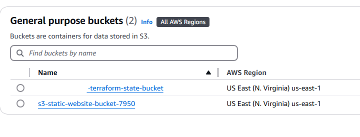

*Verifying Static Website Enabled*<br>
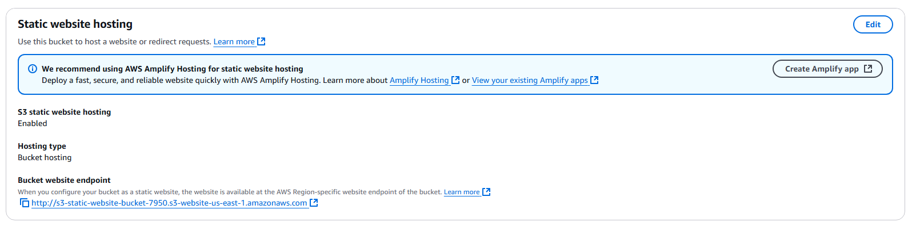

*Testing index.html route*<br>
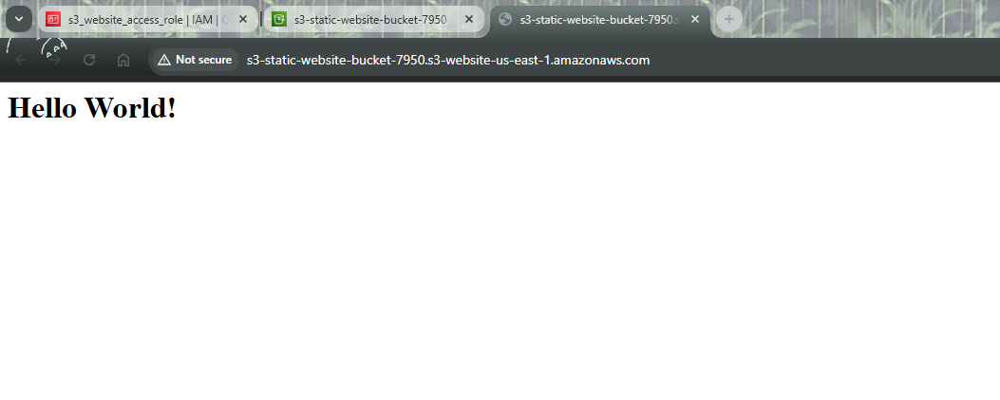


### IAM

After the S3 bucket was created, IAM permissions needed to be configured for the bucket.  Following the architecture diagram that was laid out [here](../architecture/index.md), I configured the bucket to public-read through the s3 bucket acl.  Once this was done, I created the bucket policy to be attached.  Before the policy could be created, a role was created to access the S3 bucket through the boto3 API.  The policy would only allow the assume role to have additional action permissions within the bucket including PutObject, DeleteObject, and GetObject.  It is important that the permissions are limited, as we would like to continue to follow the principle of least privilege throughout the project. <br>
The next step in the process was configuring the role itself.  The role needs a policy that can allow access to the S3 bucket.  Similar to the bucket policy, this IAM policy should only allow for the required actions that the script needs.  Once this was done, the IAM user can assume this role in code.  Before proceeding to the next phase of the project, I wanted to confirm my changes were as intended.  This can be shown in the screenshots below.

*Screenshots*

*Showcase of assume role policy added to justin user*<br>
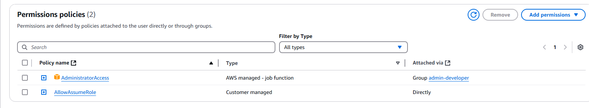
(Please note that Administrator privileges were added to run the terraform plans/applies)

*Showcase of bucket policy attachment within s3 bucket*<br>
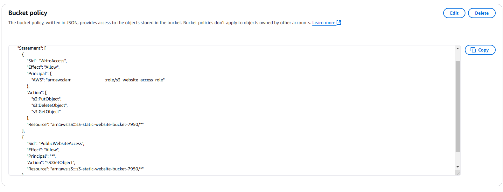

*Challenges*<br>
When working with S3 and IAM, the most challenging part of this portion had to be the interconnected components required to build up infrastructure.  When working with policies, it is important to follow the *principle of least privilege*, allowing only specific resources to have access.  For example, we want only the *role* to be able to create objects in S3.  Others would only be able to view the website and its contents.

When running the S3 resource applies, I ran into the following error message attempting to create the S3 bucket policy and attaching it to the S3 Bucket:

```
Error: Error putting S3 policy: AccessDenied: User: arn:aws:iam::xxxxxxxxxx:user/justin is not authorized to perform: s3:PutBucketPolicy on resource: "arn:aws:s3:::s3-static-website-bucket-7950" because public policies are blocked by the BlockPublicPolicy block public access setting.
```

After doing [research](https://registry.terraform.io/providers/hashicorp/aws/latest/docs/resources/s3_bucket_acl), I found that I had not configured the S3 Bucket ACL via terraform.  After doing so, I was able to properly view the bucket and its contents.

When configuring the policies, I saw a few errors:
```
Error: Error putting S3 policy: MalformedPolicy: Invalid policy syntax.
```
After looking into it, I learned that this can be caused by the Principal field misrepresented as a string rather than its inteded object.  After making the change, it looked like this:

```
    Principal = {
      AWS = aws_iam_role.website_access_role.arn
      }
```
For the IAM Policy, I had this error:
```
Error: creating IAM Role (website_access_role): MalformedPolicyDocument: The following Statement Ids are invalid: Assume Role to Access S3 Bucket
```
This error indicated that I was using the SID wrong.  While I was using it as a statement identifier, the way I used it having "Assume Role to Access S3 Bucket" was closer to a description.  As a result, I changed it to `AssumeRolePolicy` and that fixed the problem.

## Detour - Python Coding
Once this was done, I began working on the Python script before moving onto the other architectures.  The reason for this was to confirm that the IAM permissions were sufficient enough to complete the task.  The first thing I did to start this process was look at the available functions for the S3 client.  This was done by reading the [AWS documentation](https://boto3.amazonaws.com/v1/documentation/api/latest/reference/services/s3.html).  After gathering this information, I wanted to create a script that did the following:

```
- Reads from a list of files in a subdirectory called "to-upload"
- Verify these files are supported file types (.html, .css, .jpg, .png, etc.)
- Check if any of these files are inside the bucket already
- If the files are not, upload to the bucket
- If the files are inside the bucket, ask for confirmation before overriding the current version
- List out the files that are successfully uploaded to the bucket
```

As I was working on the script, I began to notice something with how I was configuring my S3 bucket.  In the boto3 documents for [get_object](https://boto3.amazonaws.com/v1/documentation/api/latest/reference/services/s3/client/get_object.html), I read about how the objects were encrypted.  By default, the bucket configuration was set to *Server-side encryption with Amazon S3 managed keys (SSE-S3)*.  Essentially, this means that objects are encrypted and decrypted at rest using AES-256 (Advanced Encryption Standard).  Encryption is what keeps our object data in an unreadable format to others.  Without a proper key, users would not be able to properly view these files.  One suggestion that could be made would be creating my own KMS key that I would manage.  This provides more control over security and can further isolate the S3 bucket.  While this may be the case, I chose not to proceed with making an additional KMS key as this was not the original scope of the architecture.

As listed in the challenges, I learned about the importance of `ContentType`.  Using the mimetypes library, I was able to automatically populate this field.  Once this was done, I saw the following result in testing:

```
File styles.css found in the S3 bucket
File index.html found in the S3 bucket
Uploaded file styles.css to bucket: s3-static-website-bucket-7950
Tagged file styles.css in bucket: s3-static-website-bucket-7950
Uploaded file index.html to bucket: s3-static-website-bucket-7950
Tagged file index.html in bucket: s3-static-website-bucket-7950
```

The screenshot of index.html can be found below.  Observe that the index.html file uses the css properties stored from styles.css!

To authenticate the security of our work, I have ran the script without permissions and received the following:

```
botocore.exceptions.ClientError: An error occurred (AccessDenied) when calling the PutObject operation: User: arn:aws:iam::xxxxxxxxxx:user/justin is not authorized to perform: s3:PutObject on resource: "arn:aws:s3:::s3-static-website-bucket-7950/styles.css" because no identity-based policy allows the s3:PutObject action
```

From an outsider's perspective, this is essentially saying that a user cannot put their object into the s3 bucket.  In our case, we want to be able to assume the role to be able to do this in our python code.  Working on the implementations for assuming the role, I utilized [sessions](https://boto3.amazonaws.com/v1/documentation/api/latest/reference/core/session.html) to manage the assumed role.  The assumed role contained the policy that we created in the previous part.  It took some more debugging to update the policy, as I ran into the following error:

```
botocore.exceptions.ClientError: An error occurred (AccessDenied) when calling the AssumeRole operation: User: arn:aws:iam::xxxxxxxxxxxx:user/justin is not authorized to perform: sts:AssumeRole on resource: arn:aws:iam::xxxxxxxxxxxx:role/s3_website_access_role
```

Once the policy was updated, I realized that we then have to create a new session from the original created (hence `new_session`) that uses the response parameters from the sts.assume_role() function call.  In doing so, after removing the Admin Credentials that were used to create the terraform resources, the script was still able to successfully populate the bucket with files:

```
File styles.css found in the S3 bucket
File index.html found in the S3 bucket
Uploaded file styles.css to bucket: s3-static-website-bucket-7950
Tagged file styles.css in bucket: s3-static-website-bucket-7950
Uploaded file index.html to bucket: s3-static-website-bucket-7950
Tagged file index.html in bucket: s3-static-website-bucket-7950
```

At this stage of the project, I gained a clear understanding of how the policies and principles interacted with the proposed architecture. The bucket policy is the primary policy governing access to the S3 bucket itself. Initially, this policy was correctly configured, with only the S3 Role as the principal for restricted actions.

Three additional policies needed to be created. The first policy was for the S3 role upon creation. This specific policy, `s3_website_access_role`, was intended to grant access to assume the role. Initially, it was configured with `s3.amazonaws.com` as the principal. However, this was incorrect because the *Principal* refers to the entity that is allowed to assume the role. In this case, the user who will be assuming the role needs permission, not the service itself. The second policy, `s3_website_access_policy`, granted the assumed user permissions by attaching it to the IAM role. This policy allowed access to the restricted actions, which would only be granted after the role was assumed. The final policy was for the user `justin`. Without this policy, the user wouldn't have been able to perform the AssumeRole action, even if the role permitted it. To adhere to the principle of least privilege, the policy restricts the Resource to the role ARN.

One key lesson I learned when creating these policies was the distinction between Principal and Resource. The **Principal** defines who the policy applies to, whereas the **Resource** specifies the item or set of resources that can be *affected* by the policy’s actions.

*Additional Challenges*<br>
When working on the Python script, I had a few errors with the boto3 API.  When using the put_object method, I was unable to properly upload files to the bucket.  In my previous implementation, I had:
```
path = f"./to_upload/{file}"
with open(path, "r") as file_path:
    upload_success = s3.put_object(Body=file_path,
                                   Bucket=bucket,
                                   Key=file)
```
The first issue that I noticed was after seeing this error:

```
botocore.exceptions.HTTPClientError: An HTTP Client raised an unhandled exception: a bytes-like object is required, not 'str'
```

This indicated that I was misusing the file itself, as I should be treating the information as bytes rather than strings.  To fix this, I updated the open method to use the following:
```
open(path, "rb")
```

 After seeing that the files were uploaded, I could no longer view them as HTML documents visiting the bucket.  Instead, each time I would visit the S3 website I would be forced to download the file.  After looking through a few fourms, I found that this is because the `ContentType` field in my [put_object](https://stackoverflow.com/questions/18296875/amazon-s3-downloads-index-html-instead-of-serving) method.  Lastly, these changes did not propagate onto the website instantly.  These changes only showed when viewing through an incognito browser.  I believe that this could be due to browser caching and cookies.  Once I cleared my cache, this issue was resolved.


*Screenshots*

*Showcase of S3 Object Encryption Configuration*<br>
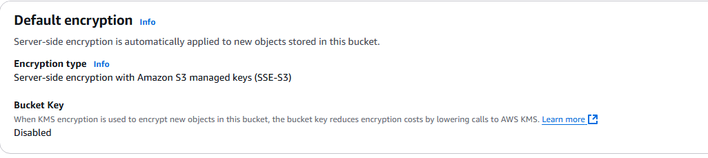

*Showcase of S3 Object Upload*<br>
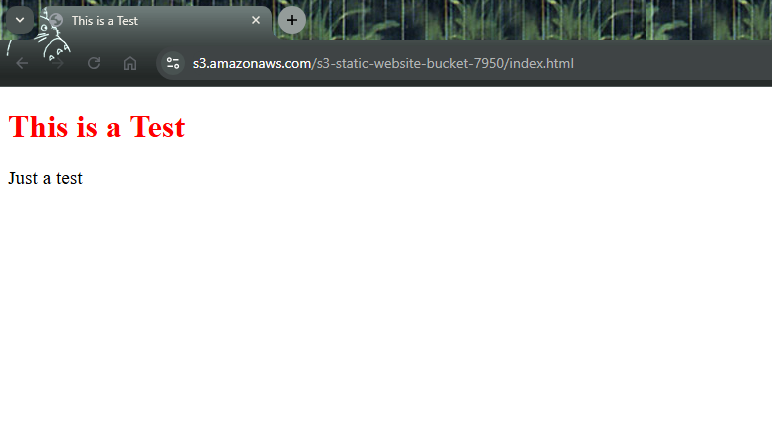

## Terraform - GuardDuty

Getting back into the swing of things with Terraform, it was time to start the next part of the project - GuardDuty!  The goal of this part was to assist in scanning the S3 bucket for malicious uploaded files as well as any incoming security events within the specific bucket.  After many challenges (see below), I was able to finally configure the bucket to use GuardDuty.  

Looking at the [documentation](https://registry.terraform.io/providers/hashicorp/aws/latest/docs/resources/guardduty_malware_protection_plan), to get Malware Protection Scanning, an additional resource was created.  To maintain security, a new IAM role was created with an additional policy was created to be referenced in that resource.  A few tests were done once GuardDuty was configured.

Viewing the initial findings (see first screenshot), it stated that the CreateMalwareProtectionPlan was invoked using root credentials.  When creating terraform resources I've used the root credentials.  This is a good lesson to utilize the user `justin` instead.  The second finding warned about allowing Anonymous Access to the S3 bucket.  Since the bucket was configured to be a publicly accessible S3 website, this behavior is intended.  When testing the upload image features, I attempted to upload a dangerous HTML file (malicious.html).  This HTML file was intended to contain a malicious URL that users may click on.  When testing the upload, GuardDuty has tagged the object as "NO_THREATS_FOUND".  Looking into the reason why, GuardDuty does not scan HTML files for vulnerabilities.  Instead, it would be able to detect Malware such as executable files and suspicious traffic to servers.  At this point in the experiment, I did not have a malicious executible and proceeded with the next set of resources to create.

*Challenges*<br>
The error that took the longest was when I had to create the Malware Protection Plan.  

```
│ Error: creating AWS GuardDuty Malware Protection Plan (malware protection)
│
│   with aws_guardduty_malware_protection_plan.protection_plan,
│   on guardduty.tf line 19, in resource "aws_guardduty_malware_protection_plan" "protection_plan":
│   19: resource "aws_guardduty_malware_protection_plan" "protection_plan" {
│
│ operation error GuardDuty: CreateMalwareProtectionPlan, https response error StatusCode: 400, RequestID: 80796efd-3025-4c24-acef-f787e34d4aa2, BadRequestException: The request was rejected because the provided IAM role does not have
│ the required EventBridge PutRule and PutTargets permissions to create a Managed Rule.
```

Looking at various sources, I had ensured that proper S3 actions were accounted for.  What I failed to consider was access to AWS events.  Reading this [article](https://docs.aws.amazon.com/guardduty/latest/ug/malware-protection-s3-iam-policy-prerequisite.html) on the configuration, I followed similarly when creating the policy.  This fixed the problem and the GuardDuty resource was able to be created.

*Screenshots*
*Showcase of GuardDuty Findings in S3 Bucket*<br>
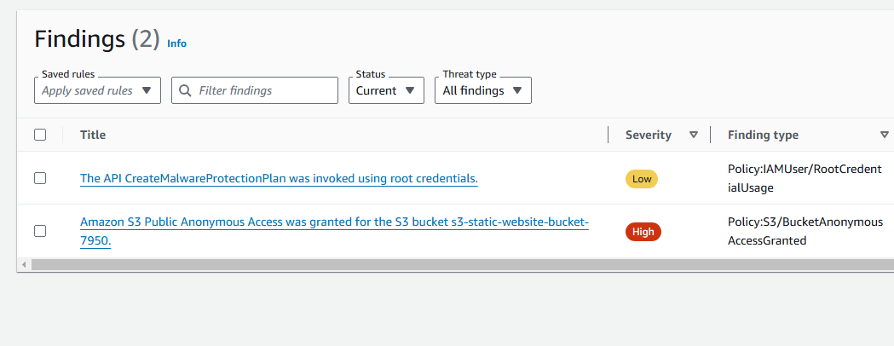

*Showcase of GuardDuty Tagging for S3 Object*<br>
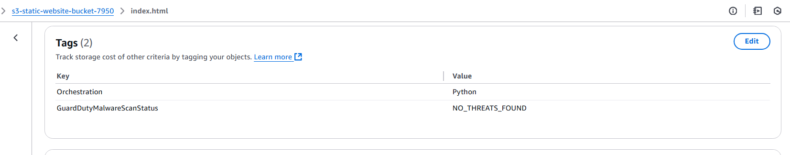

*Showcase of GuardDuty Malicious File Attempt*<br>
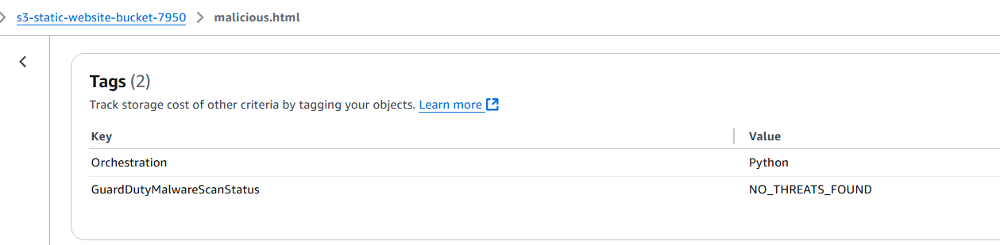

## SNS

Initially, the next service that I was going to build out was EventBridge.  After reading the terraform [documentation](https://registry.terraform.io/providers/hashicorp/aws/latest/docs/resources/cloudwatch_event_rule), I decided to create the SNS resources first.  Essentially, GuardDuty will be configured as the target while EventBridge needs to be able to publish to SNS.  Because of this, SNS needs to be created first.

When creating the SNS components, there was not too many difficulties.  To understand how SNS works, the topic and a subscription needs to be explained.  The *SNS topic* is a communication channel that can be used to send notifications to.  The *SNS subscription* is attached to the SNS topic to receive messages.  In our case, the SNS subscription would be configured for emails.  Additionally, an SNS topic policy was created for EventBridge access.  Since EventBridge was not created yet, the Resource was set to **"\*"** for now and will be updated later on.

Once the terraform code was written and applied, it showed that all 3 resources were created successfully.  In order to get the SNS subscription verified, a confirmation email was sent to the specified email address (see first screenshot).  After clicking the verify link, the SNS infrastructure was complete.  To test that SNS was working, I used the AWS console to publish a **Test Message** to the given email.  After publishing the message, I was able to verify the sent message at my email address (see screenshots)!


*Screenshots*
*AWS Email Confirmation*<br>
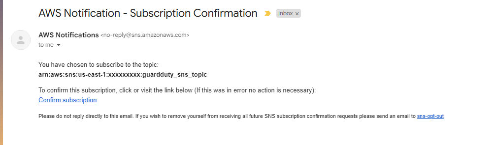

*Showcase of SNS Topic and Subscription*<br>
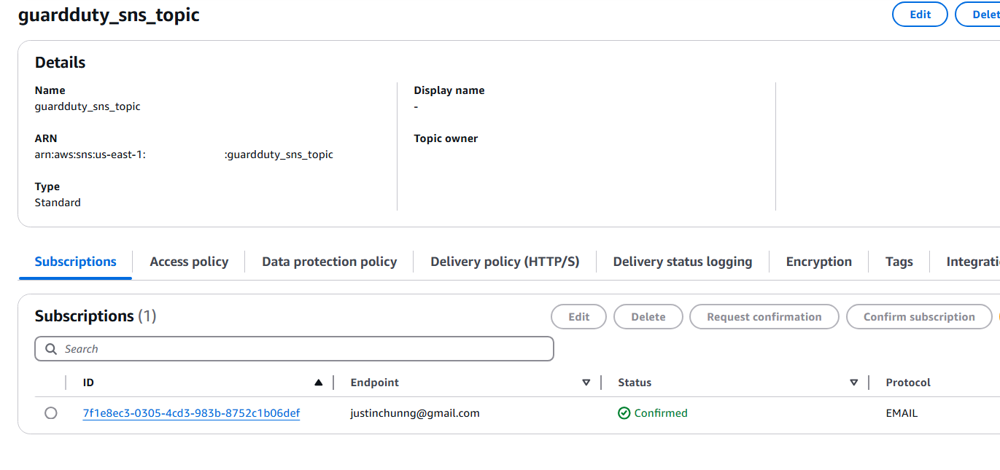

*SNS Console Test*<br>
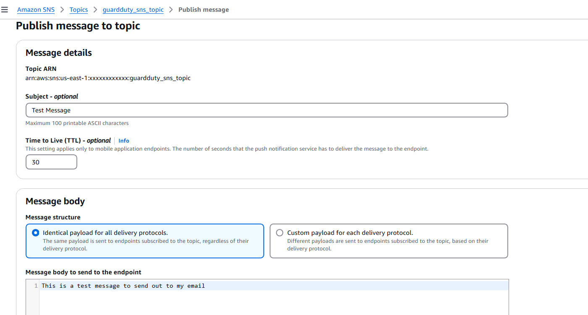

*SNS Test Result*<br>
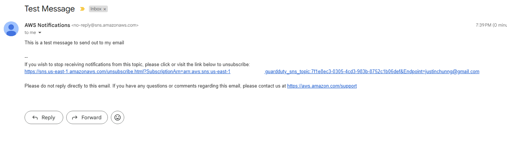

## EventBridge

EventBridge was the last component that needed to be created in this project.  With that being said, I spent the *most* time working on creating this service, as debugging the various problem was challenging.  EventBridge has 3 main components that needed to be created in Terraform.  The EventBridge *Bus* is the channel that acts as a bridge between events and other AWS services.  In the Event Bus, there are Event *Rules*.  Each rule contains a "Match Pattern" that is used to detect a certain event pattern.  In this case, the event pattern would be looking for GuardDuty and each findings' severity level.  The Event *Target* is what we would like to send the event information to.  The target in this case would be the SNS Topic that was created in the previous step.

When working on this component, a decision was made to use the `default` Event Bus.  The reasoning will be explained in the **Challenges** section.  After all the issues were resolved, I made one final test by uploading a malicious executable from a Kali Linux Virtual Machine into the S3 bucket.  The executable was downloaded from Malware Bazar.  A GuardDuty Finding was generated and the SNS topic published to my email (see last screenshot)!

*Screenshots* <br>
*Showcase EventBridge Rule not Triggering*<br>
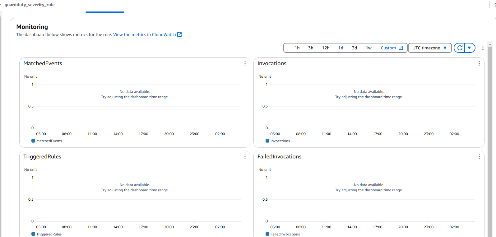

*Retrieve Object Upload JSON Findings*<br>
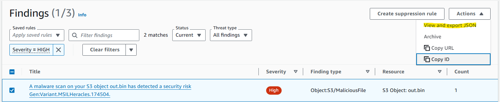

*Inspect GuardDuty Findings*<br>
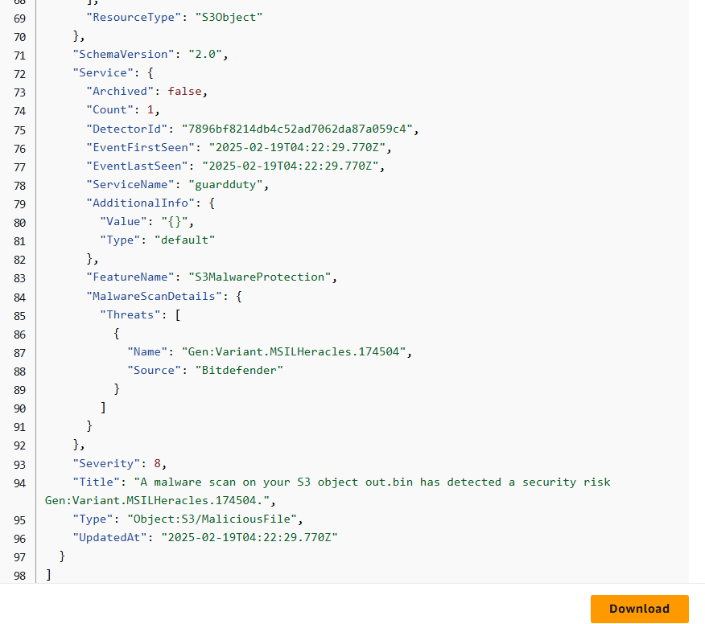

*Test Rule Created*<br>
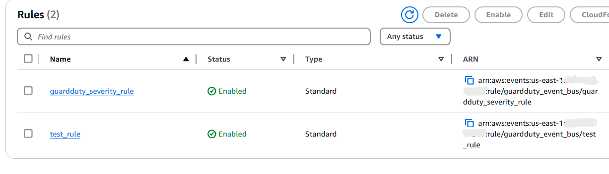

*EventBridge Test Pattern*<br>
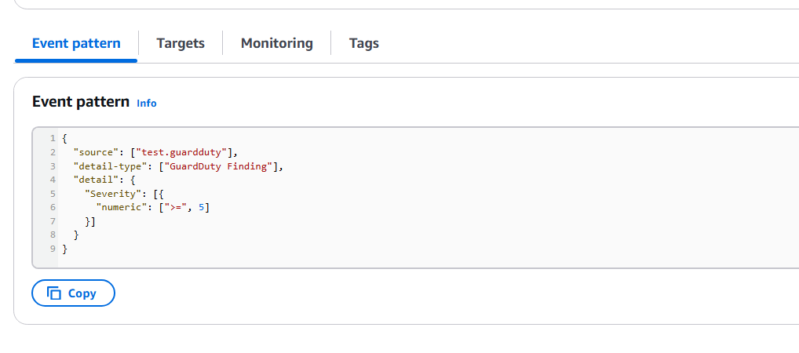

*Test Rule Triggered*<br>


*EventBridge GuardDuty Triggered Result*<br>
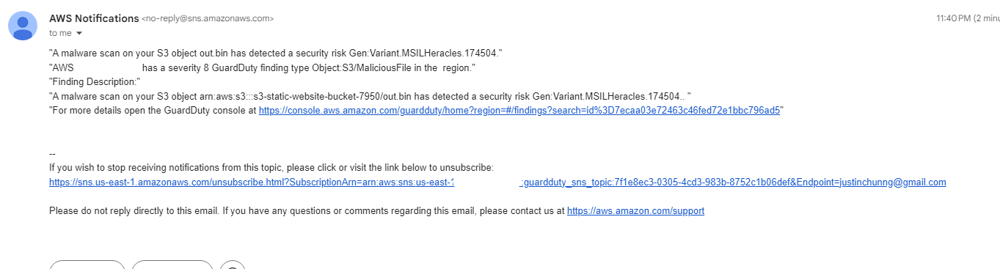

*Challenges* <br>

The first challenge that I ran into was configuring the resources:
```
│ Error: "rule" cannot be longer than 64 characters: "arn:aws:events:us-east-1:xxxxxxxxxxxx:rule/guardduty_event_bus/guardduty_severity_rule"
│
│   with aws_cloudwatch_event_target.sns,
│   on eventbridge.tf line 16, in resource "aws_cloudwatch_event_target" "sns":
│   16:   rule      = aws_cloudwatch_event_rule.guardduty_event_rule.arn
│
╵
╷
│ Error: "rule" doesn't comply with restrictions ("^[0-9A-Za-z_.-]+$"): "arn:aws:events:us-east-1:xxxxxxxxxxxx:rule/guardduty_event_bus/guardduty_severity_rule"
│
│   with aws_cloudwatch_event_target.sns,
│   on eventbridge.tf line 16, in resource "aws_cloudwatch_event_target" "sns":
│   16:   rule      = aws_cloudwatch_event_rule.guardduty_event_rule.arn
│
```

To fix this error, rule had to be configured to use name instead of arn.

```
│ Error: creating EventBridge Target (guardduty_severity_rule-SendToSNS): operation error EventBridge: PutTargets, https response error StatusCode: 400, RequestID: e3b68bec-b11e-4325-8bb2-8ba522478cd7, ResourceNotFoundException: Rule guardduty_severity_rule does not exist on EventBus default.
│
│   with aws_cloudwatch_event_target.sns,
│   on eventbridge.tf line 15, in resource "aws_cloudwatch_event_target" "sns":
│   15: resource "aws_cloudwatch_event_target" "sns" {
```
To fix this error, the cloudwatch_event_target had to be configured to include the event_bus_name field. <br>

The last issue that I ran into was the was testing submitting GuardDuty findings to the EventBridge Bus.  There were a few things that needed to be done to reach a conclusion.  Debugging this issue was rather difficult.  From my perspective, I viewed that findings were shown within the GuardDuty console when uploading a malicious S3 object, but the event was not passed to the Custom EventBridge (see first screenshot).  While this shows just the EventBridge *rule* not displaying traffic, this also applied to the bus.  One change that I noticed was the EventBus policy.  Adding the [aws_cloudwatch_event_bus_policy](https://registry.terraform.io/providers/hashicorp/aws/latest/docs/resources/cloudwatch_event_bus_policy), this configured the bus to allow events from GuardDuty.  

The next thing I tried was testing if the event from the console.  Additionally, I created the `eventbridge_guardduty_role`, which allowed EventBridge to publish to the SNS topic.  In each Event Bus, there is a feature to `Send Events`, which accepts an event source, detail type, and detail content.  To get the detail content, I retrieved the data by exporting the finding JSON from GuardDuty (see screenshots).  My current `event_pattern.json` uses `aws.guardduty` as the source.  One thing that I ran into when testing was that I was not "authorized" to use this source.  After looking into [this](https://repost.aws/questions/QU9O1i3AITRTqn32Kf6yTxFA/eventbridge-to-lambda-notauthorizedforsourceexception), I discovered that the event source cannot use "aws".  Instead, I changed the source to use test.guardduty in a test rule (see screenshots).  Doing this, I was able to confirm the event pattern and published to the SNS topic.

The last part of this was answering the question of connecting the Event Bus to GuardDuty.  By default, GuardDuty findings are sent to the **default** bus.  The only way to get this to send to the custom bus would be propagating the events from the default bus.  To keep it simple, I moved my findings and resources to the default bus.  In doing so, when generating a GuardDuty finding, I was able to see a successful SNS message!

Looking back on the challenge, I should have created a Cloudwatch Group that would show the errors of the problems I've encountered.  In the future, I will implement this practice for future developments with AWS.

## Python Scripting - Clearing S3 Malicious Files

As I was working on configuring GuardDuty with EventBridge, another idea that came to mind was to remove any malicious files that were identiified within the S3 bucket.  While the identification process was similar to the `s3_store.py` script, it removes any GuardDuty-scanned objects that were tagged as a threat (THREATS_FOUND).  Using s3_store as a reference, I ran into minimal issues when creating the new script `s3_clear_malicious_files.py`.  When running through the tests on my local machine, I saw the following:

`Using --dry-run argument:`
```
python3 s3_clear_malicious_files.py --dry-run
Dry run has been enabled.
Could not find GuardDutyMalwareScanStatus tag in the object: error.html
Could not find GuardDutyMalwareScanStatus tag in the object: malware-protection-resource-validation-object
GuardDuty has identified a malicious object: out.bin
Identified 1 malicious files to be removed:
- 'out.bin'
No objects were removed as Dry Run has been enabled.
```

`Without --dry-run argument`
```
python3 s3_clear_malicious_files.py
Could not find GuardDutyMalwareScanStatus tag in the object: error.html
Could not find GuardDutyMalwareScanStatus tag in the object: malware-protection-resource-validation-object
GuardDuty has identified a malicious object: out.bin
Identified 1 malicious files to be removed:
- 'out.bin'
Deleted object: out.bin
All malicious files have been removed.
```

After doing so, I checked the S3 bucket and the **out.bin** object that was added was successfully removed from the bucket!  Interestingly enough, error.html was not properly tagged by GuardDuty.  Upon further investigation, this was because the object was added *before* GuardDuty was correctly configured for the S3 bucket.

## Cost Analysis

When going into the Root User to view the current costs within the account, the total was still $0.00 (see screenshot)!  This is due to the account being under `Free Tier`.  With the resources that were created, AWS offers free monthly limits that give users an opportunity to build out infrafrastructure patterns.  For example, Free Tier offers 5 GB of storage free of charge every month.  In our case, S3, EventBridge, SNS, and GuardDuty were covered so charges were not induced during this project.

To read more about Free Tier account resource limits, you can do so [here](https://aws.amazon.com/free/).

*AWS Cost Results*<br>
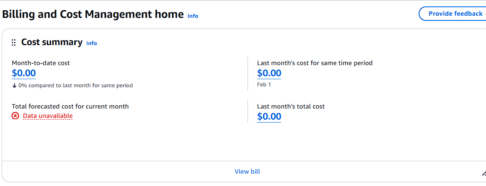

## Dismantling Project Resources

Once the project was complete, the resources created in my account need to be destroyed to prevent any additional costs.  While this configuration does not incure any costs at the moment, it may once my Free Tier account trial ends.  Since the project was written using Terraform, we can simply run the `terraform destroy` command that would cause all the resources to be removed.

One minor issue that I encountered was trying to remove the AWS GuardDuty Malware Protection Plan.  The issue I was having was this error:

```
aws_guardduty_malware_protection_plan.protection_plan: Destroying... [id=acca817ce14c516012c2]
╷
│ Error: deleting AWS GuardDuty Malware Protection Plan ("acca817ce14c516012c2")
│ 
│ operation error GuardDuty: DeleteMalwareProtectionPlan, https response error StatusCode: 400, RequestID: 9fd82134-d740-4930-9026-ef7a808e90a0, BadRequestException: The request was rejected because the provided
│ IAM role cannot be assumed by the service.
╵
```

When checking the console, it turns out that the IAM Role that was created had been deleted before the protection plan could be disabled.  To fix this issue, I reassigned a temporary role in the console that was then terminated after rerunning the `terraform destroy` command.

Once this was done, all of the resources that have been created were removed from terraform state and within the account!

## Reflections

After completing this project, there were many takeways that I had:
- Designing architecture can be easier than implementing the design 
  -  Upon initially creating the proposed architecture, I thought that the implmentation of the design would be smooth sailing.  In my mind, with a solid diagram listing out what each component relies on another component and vice versa.
  - This proved not to be the case, as each component needed to be understood with their separate intricacies.  This leads into the next point that will be discussed below.
- Starting from scratch can be difficult!
  - This point could have been said before the previous point, but this is in the context of infrastructure.
  - Each component that needs to be created may also need something that is not explicitly written within the Architectural Diagram.  This may be an oversight on my part, but I wanted to keep the diagram as simple as possible so it was easier to understand without knowing specifically what's going on "under the hood".
  - While I currently work at a company that utilizes Terraform, it can be challenging to build out a brand new repository without having a reference.  With that being said, the challenge provided a lot of technical learning that would help me do similar projects in the future!
- Debugging Infrastructure can be improved
  - As discussed in the EventBridge section, I did not debug the service issues I was having "properly".
  - In other cases, with the challenges faced in earlier sections, I could have done things better as well.  This shows that there is a lot of room for improvement to solve these issues faster next time.
  - To do so, in future projects, I will try to use AWS built in services including the creation of CloudWatch Log Groups and CloudTrail Trails.
- Security in the Cloud is important!
  - The original itention of this project was to create a "Secure" Static Website that was hosted on an S3 bucket.  The title of this project is a little misleading, as users are able to view static content from the bucket due to it being a publicly available.  What was being secured were the permissions to upload/remove files from the bucket.  Additionally, GuardDuty was the cherry on top to ensure such files were not malicious.
  - Having created the IAM Roles and Policies associated for the bucket, I see great value in the work I've done to maintain security.
  - It is important to continue to use the principle of least privilege, as only specific users or resources should be able to access such services.
- Optimizations can always be made!
  - Access to the S3 Website was difficult from the developer's perspective.  To fix this, we could add a Route53 domain that would have a record pointing to the S3 endpoint.
  - As discussed in the EventBridge section, the default bus was used for the Event Rule and Event Target.  Ideally, these resources should be in their own custom Event Bus, as having all rules inside the default bus can get tricky to manage.
  - To provision the resources, I used the user `justin` that was already created before starting the project.  Ideally, this user's permissions should be separate from the role and policies that were associated.  To improve this, a new **separate** user should be created instead.
  - Outside of AWS, the current repo is not using runners for each github PR.  To improve the checks being made on each commit, a CI pipeline can be created to run these pre-commit checks through automation.
- Proud of the work that was done!
  - This project took a lot of work to complete.  When I first saw the idea, I realistically thought it would only take a few days to finish.  Wrapping this up after almost a month and a half, I was wrong.
  - Part of the reason being creation of resources through IaC and having proper documentation, this organization will be benefitial for future projects as well.  I would like to continue to maintain a high standard for quality work that is being done in my journey as a Cloud Engineer!

If you've read this far, I would just like to give you a big thank you for your support!  Hope to see you soon in projects to come!

